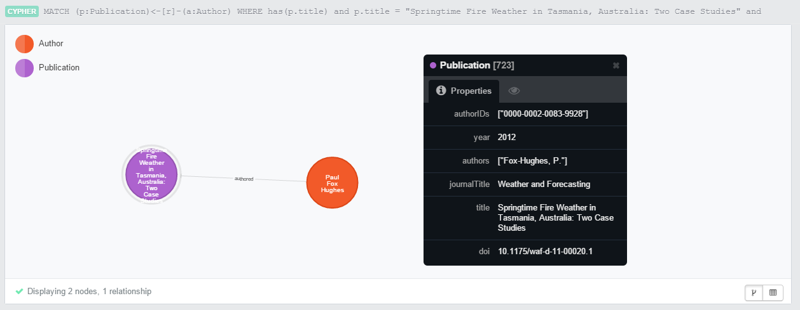

# Bibliometric Author Analysis

Project to identify person based on publications and associate them with various
identifiers.

* Gregor von Laszewski (laszewski@gmail.com)
* Fugang Wang (kevinwangfg@gmail.com)
* Siddhardha Raju Mandapati (siddhardha.rm@gmail.com)
* Amritanshu Joshi (amritanshujoshi@gmail.com)

## Description

The idea of the project is to solve the high ambiguity of the author names
in bibliographic data. In most of the technical papers and publications, the
authors are identified only by their name.
  
However, different people can have the same full name. So it is a very difficult
task to specifically identify the correct person when only the name is provided.
The problem becomes even more challenging when the alias names of the authors
are provided, as a person can have multiple alias names.
  
We plan to remove the name ambiguity by plotting the authors in a social network
graph using co-authorship as relations between nodes and then finding the best
match of the author of a paper in the graph.


## Requirements

Following are required to run the project.

  * python 2.7 (Python 3 has not yet been tested)
  * pip
  * requests
  * xmltodict
  * pymongo
  * py2neo
  * mongodb database server
  * neo4j database server


## Instructions for setting up the required tools

### Python modules

Note: The instalation has been tested on Ubuntu

We recommend that you use pyenv or virtualenv to make sure you isolate the
instalation from your system python. In cas eyou use virtualanv do:

```bash
$ pip install virtualenv
$ mkdir biblio
$ cd biblio
$ virtualenv biblio
$ source biblio/bin/activate
```

Next install the following modules

```bash
$ pip install matplotlib
$ pip install requests
$ pip install xmltodict
$ pip install pymongo
$ pip install py2neo
```

you will also need 

  * orcid-python
  * git+https://github.com/scholrly/dblp-python.git


### MongoDB

You will also need to install pymongo and mongo. The steps to install 'mongodb'
can be found in the URL:

* <http://docs.mongodb.org/manual/installation/>

Please follow the instructions for your particular version of the OS. 

The easiest wahy to manage your mongo instalation is with cloudmesh. However,
for now we assume you have installed and run mongo on the defulat port. If you
need different configurations, you can customize them in
`constants/constants.py`

### Neo4j

The steps to install 'neo4j' can be found in the URL: 

* <http://neo4j.com/download/>
   
Please follow the instructions for your particular version of the OS.  Download
and install neo4j community edition. Start the server. (In Mac/Linux, `cd` in
terminal to the extracted folder and then enter the command
   
```bash
$ bin/neo4j start
```

Make sure that you are able to connect to the neo4j server instance at
"http://localhost:7474" in a web browser.

## Instructions to run the author bibliometric analysis

It takes around 90-120 minutes to run the project with default settings (on an
old computer). It is significantly faster now. If you want to skip it, then the
graph database generated by running the project is provided under
'Neo4j/default.graphdb' folder. Skip to the last instruction in step 8 if you
don't want to run the project.)

1. Download the project and go to the directory:

```bash
$ git clone https://github.com/scienceimpact/bibliometric
cd bibliometric
```

2. Make sure that your mongodb and neo4j server instances are running. Make sure
   that you are able to connect to the default instances of these servers without
   any user credentials. Instructions to these are provided in the above section.

3. The project is setup with default settings. To run the project with these
   default settings, go to next step. If you want to change the default settings,
   then follow the instructions in the section "Change project settings" before
   proceeding to the next step.

4. Make sure that you have an active internet connection before running the
   project. The project retrieves the Author and Publication data from ORCID and
   IEEE websites, parses it in the required format and builds a social network
   graph on neo4j server with 'authored' relationships between Authors and their
   Publications.

5. Add the project root folder to PYTHONPATH.
   In Windows, add PYTHONPATH in Environment variables.
   In Linux, add PYTHONPATH to '~/.bash_profile' and then enter the command "source ~/.bash_profile" in terminal.

7. Make sure that you are in the project root folder in the terminal. To run the
   project, enter the command

   ```bash
   $ python main/main.py" in terminal.
   ```
   
   Under the default settings, the project runs for 90-120 minutes if you have a stable and fast internet connection.
   If the project runs successfully (on receiving the message `Finished loading data`), then skip the next step and go to step 

8. If the run fails due to an intermittent error, then drop the mongodb and neo4j databases and then rerun the project as in the previous step.
   
   To drop the mongodb database, first connect to mongodb server using the
   command "mongo" In mongo client, enter "show dbs". If the database named
   'biblio' is present then drop it using the below commands. First enter "use
   biblio;" and then enter "db.dropDatabase();" in mongo client. This drops the
   'biblio' database.
   
   To drop the neo4j database, first stop the neo4j server using the command
   "bin/neo4j stop" in neo4j extracted folder. Delete the 'graph.db' folder
   under the folder named 'data' in neo4j extracted folder. This drops the
   default database. In case of Windows, the 'graph.db' folder may be in your
   'Documents\Neo4j' folder as 'default.graphdb'. Again start the server using
   the command "bin/neo4j start" in neo4j extracted folder.
   
   The generated Neo4j database by running the project is provided under 'Neo4j'
   folder of the project as 'default.graphdb'. In case you don't have an
   internet connection, copy the contents of this folder 'default.graphdb' to
   the folder 'graph.db' and restart neo4j server. This loads the database.
   
9. Refresh the Neo4j browser client page "http://localhost:7474". 
   Under the default settings, 270 Author nodes and 2814 Publication nodes with 'authored' Relationships between them are created.

10. Now all the data is loaded into Neo4j. You can run cypher queries on the
neo4j browser instance to test the project. All the test cypher queries are
given in the file 'test_queries.docx'

## Change settings

1. The project settings are either under 'constants/constants.py' file or under 'main/main.py' file in the project folder.

2. By default, the project runs until at least 250 Author nodes are retrieved.
   If you want to change this value, update the value of
   retrieve_authors_upto_count in 'constants/constants.py' file. Note that
   increasing this value will take more time for the project to run and decreasing
   this value results in too less data for testing.

3. If you want to change the mongodb connection settings, they can be changed in
   'constants/constants.py' file. All the variables are under 'mongo_constants' and
   are self explanatory.
   
4. More options to run the project are provided in 'main/main.py' file. The details are as described in the file.

Note: If you want to re-run the project, then make sure to delete the mongodb and neo4j databases. They are created while running the project. Details on deleting mongodb and neo4j databases are provided in the above section under step 8.

## Screenshot closeups


Author relationships


## Acknowledgement

If you use this project code or data generated based on this program you need to cite the following paper:

>  Fugang Wang, Gregor von Laszewski, Geoffrey C. Fox, Thomas R. Furlani, Robert L. DeLeon, and Steven M. Gallo. 2014. 
>  Towards a Scientific Impact Measuring Framework for Large Computing Facilities - a Case Study on XSEDE. 
>  In Proceedings of the 2014 Annual Conference on Extreme Science and Engineering Discovery Environment (XSEDE '14). 
>  ACM, New York, NY, USA, Article 25 , 8 pages. DOI=10.1145/2616498.2616507 http://doi.acm.org/10.1145/2616498.2616507


It is **NOT** sufficient to just provide a web link to this source repository. 


Proposed Solution:
==================

Part 1: Creation of the author social network graph

1. Retrieve the list of all authors uniquely identifying them by an ID and store
   in a local mongodb database Author ID Sources: OrcID

2. Retrieve a list of publications with their details of authors etc. and store
   in a local mongodb database Publication Data Sources: IEEE

3. Start by picking an author name and retrieving all his publications and all
   the possible unique IDs for the author.

4. Identify all the co-authors using the publication data.

5. Use the co-author names in the next iteration to retrieve their publication
   data. Keep building the data using the co-author relationship, trying to
   identify the unique ID of each author.

Part 2: Solving the name ambiguity problem

1. Now the problem of specifically identifying an author becomes simply to query
   the graph data based on his publications or authorship relations as we have
   tried to uniquely associate each author with unique IDs while building the
   social network graph.


## Repository
 
* github.com: https://github.com/scienceimpact/bibliometric 

## Sample Queries

Below are the Cypher queries which can be used to test the project. Run
these queries in the Neo4j browser.

All the authors have a unique ORCID to uniquely identify that author. We
can further refine the search using other properties of Author and
Publication nodes while querying. Few examples are given below.

1.  **Description:** Query to return 400 'authored' relationships

    **Query:** `MATCH (a)-\[:authored\]-\>(b) RETURN a, b LIMIT 400`

    **Screenshot:**

    

2.  **Description:** Query to return the Author node having name 'Gregor
    von Laszewski'

    **Query:** *MATCH (a:Author) WHERE has(a.othernames) and
    any(othername in a.othernames WHERE othername = \"Gregor von
    Laszewski\") RETURN a*

    **Screenshot:** We can see that there is a single node having name
    'Gregor von Laszewski'

    

    

3.  **Description:** Query to return all the nodes having name 'Gregor'

    **Query:** `MATCH (a:Author) WHERE has(a.othernames) and
    any(othername in a.othernames WHERE othername = \"Gregor\") RETURN
    a`

    **Screenshot:** We can see that there are 6 nodes having name
    'Gregor'

    

4.  **Description:** Query to return all the nodes having name 'Fox'

    **Query:** `MATCH (a:Author) WHERE has(a.othernames) and
    any(othername in a.othernames WHERE othername = \"Fox\") RETURN a`

    **Screenshot:** We can see that there are 10 nodes having name 'Fox'

    

5.  **Description:** Query to return all the nodes having name 's fox',
    ignoring the case

    **Query:** `MATCH (a:Author) WHERE has(a.othernames) and
    any(othername in a.othernames WHERE othername =\~ \"(?i)s fox\")
    RETURN a`

    **Screenshot:** We can see that there are 2 nodes having name 's
    fox'

    

6.  **Description:** Query to return all the nodes having name 'fox'
    ignoring case and who authored a publication in the year 2008

    **Query:** `MATCH (a:Author)-\[r\]-\>(p:Publication {year:
    \"2008\"}) WHERE has(a.othernames) and any(othername in a.othernames
    WHERE othername =\~ \"(?i)fox\") RETURN a`

    **Screenshot:** We can see that out of 10 nodes having the name
    'fox', only one author has a publication in the year 2008

    

7.  **Description:** Query to find the author named 'fox' ignoring case
    who authored the publication 'Springtime Fire Weather in Tasmania,
    Australia: Two Case Studies'

    **Query:** `MATCH (p:Publication)\<-\[r\]-(a:Author) WHERE
    has(p.title) and p.title = \"Springtime Fire Weather in Tasmania,
    Australia: Two Case Studies\" and has(a.othernames) and
    any(othername in a.othernames WHERE othername =\~ \"(?i)fox\")
    RETURN a, p`

    **Screenshot:** We can see that out of 10 authors having the name
    'fox', only one author has authored the publication 'Springtime Fire
    Weather in Tasmania, Australia: Two Case Studies'. Thus we are able
    to identify the author uniquely as every author has unique orcid.

    

    

8.  **Description:** Query to find the author named 'Gregor' who has
    authored a publication which is also authored by the author named
    'Fox'

    **Query:** `MATCH
    (a:Author)-\[r\]-\>(p:Publication)\<-\[s\]-(b:Author) WHERE
    has(a.othernames) and any(othername in a.othernames WHERE othername
    = \"Gregor\") and has(b.othernames) and any(othername in
    b.othernames WHERE othername = \"Fox\") RETURN a`

    **Screenshot:** We can see that out of the 6 authors named 'Gregor',
    there is only one author with orcid '0000-0001-9558-179X' who has
    co-authored with an author named 'Fox'

    
